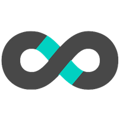

<!--
**Amarthya03/Amarthya03** is a ✨ _special_ ✨ repository because its `README.md` (this file) appears on your GitHub profile.

Here are some ideas to get you started:

- 🔭 I’m currently working on ...
- 🌱 I’m currently learning ...
- 👯 I’m looking to collaborate on ...
- 🤔 I’m looking for help with ...
- 💬 Ask me about ...
- 📫 How to reach me: ...
- 😄 Pronouns: ...
- ⚡ Fun fact: ...
-->

# Amarthya Ravi

    
 
        <h2> Software Engineer at India Urban Data Exchange <a href="https://iudx.org.in/" style="text-decoration: none;">(IUDX)</a> | Full-Stack Web Developer </h2>
    
  
    

         
     
 

 

### **Skills / Technologies Used** -

 

 

### **Contact me** -

<a href="https://www.linkedin.com/in/amarthya-ravi-2b66997b/">

 

